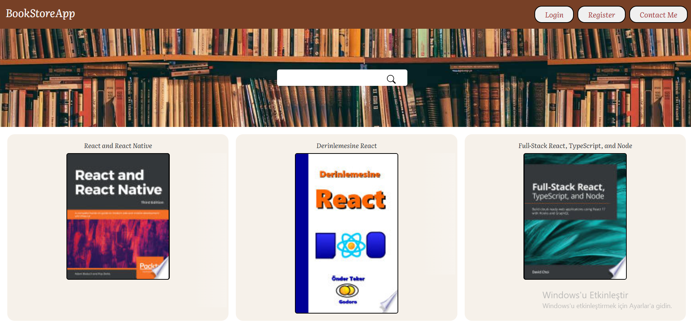
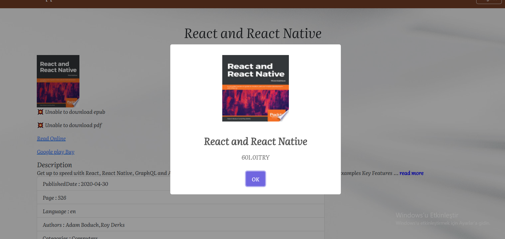

<<<<<<< HEAD
<!-- Please update value in the {}  -->

<h1 align="center">BookStore App</h1>

<div align="center">
  <h3>
    <a href="https://books-store-react-firebase.vercel.app/">
      Live Demo
    </a>
 
  </h3>
</div>

<!-- TABLE OF CONTENTS -->

## Table of Contents

- [Overview](#overview)
- [Built With](#built-with)
- [Features](#features)
- [How to use](#how-to-use)
- [Contact](#contact)

<!-- OVERVIEW -->

## Overview




## Built With

<!-- This section should list any major frameworks that you built your project using. Here are a few examples.-->

-Bootstrap 5
-Components
-useState
-useEffect
-Firebase
-useNavigate
-Custom Hooks
-Props
-RestFull API
-useContext
-React-Spinner library

## Features

This is my React BooksStore App.In this project, I wanted to make a simple book page using API. After logging in, the user can access the details of the relevant book.I used Google Book API from.

## How To Use

<!-- This is an example, please update according to your application -->

To clone and run this application, you'll need [Git](https://git-scm.com)

```bash
# Clone this repository
$ git clone https://github.com/omer-yagci/BooksStoreReactFirebase.git

# Install dependencies
    $ npm i

# Add .env file for API Keys and Firebase App Config

# Run the app
    $ npm start
```

## Contact

- GitHub [omer-yagci](https://github.com/omer-yagci)
- Linkedin [Ömer Kağan Yağcı](https://www.linkedin.com/in/omer-kagan-yagci/)
=======
# BooksStoreReactFirebase

## Description

Project aims to create a Book Store App with React,React-Router.  


                          [Live link](https://books-store-react-firebase-omer-yagci.vercel.app/)
                       
                       
                          
                          
                                              

## What I used;

Bootstrap 5

Components

useState

useEffect

Firebase

useNavigate

Custom Hooks

Props

RestFull API

useContext

React-Spinner library
>>>>>>> ddf0f888eacef0b4a91f24f1145f3621f17899bd
